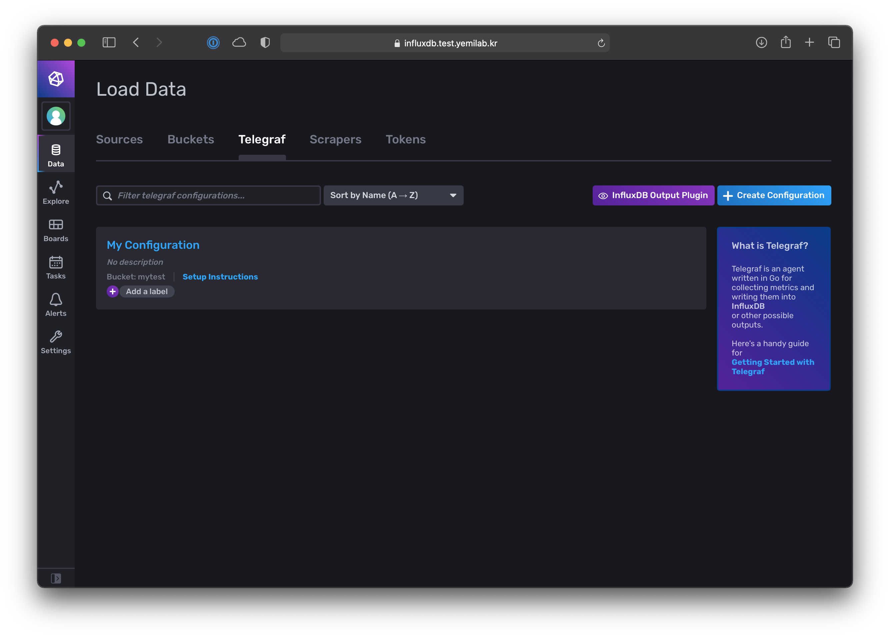
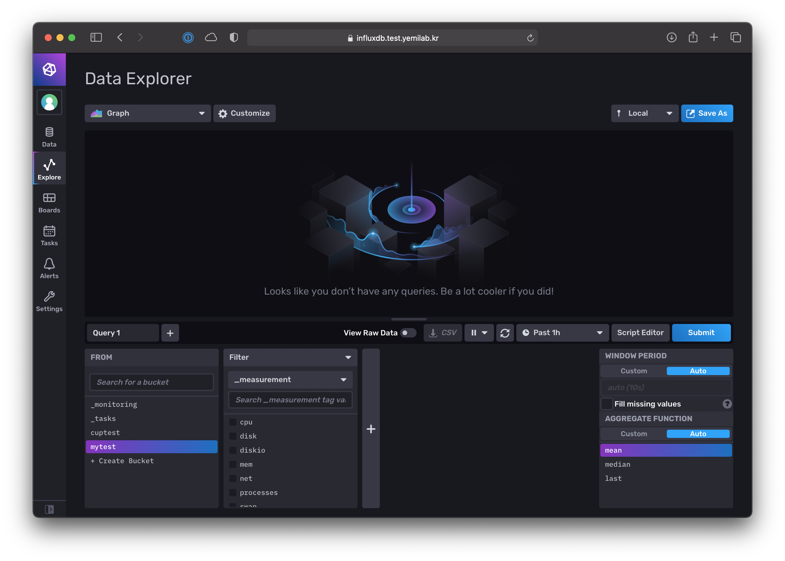

# InfluxDB example 1

## Open InfluxDB web console.

Open web browser and go to your InfluxDB web console. For example, http://localhost:8086/

Start initializing process. If you alreadly have initialized site, please skip it.

## Create bucket and Telegraf configuration

Click "data" icon in side menu.

Click "Buckets" tab.

Click "+ Create Bucket" button.

Type bucket name and click "Create" button. In this example, bucket name is "mytest".

New bucket will be created.

Click "Telegraf" tab and click "+ Create Configuration" button.

"Create Telegraf Configuration" dialog will be opened.

Select "Bucket" which had been created for this example.

Select "System".

Type "Telegraf Configuration Name". For example, "My configuration".

The configuration has been finished.

Please memo two commands.

Telegraf configuration had been created.

## Download and run Telegraf

 - Download Telegraf from [here](https://portal.influxdata.com/downloads/)
 - Install or unarchive Telegraf
    - Telegraf is a single binary file without any dependencies.
 - Run the commands you already memoed.

## Explore data

Click "Explore" button in side menu.

Select your bucket in "From" tab.

Select "cpu" in "Filter" tab and click "Submit" button.

You can check CPU usage on Telegraf running machine.

